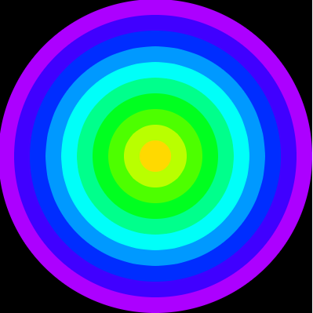

# Game Programming 2020-2021

Resources
---------
* [Processing](http://processing.org)
* [Processing reference](https://processing.org/reference/)
* [The Coding Train](https://www.youtube.com/channel/UCvjgXvBlbQiydffZU7m1_aw)
* [The Nature of Code](http://natureofcode.com/)
* [Games Fleadh](http://www.gamesfleadh.ie/)

## Past Exams
- [End of year Lab Test 2019](https://github.com/skooter500/GP-LabTest2-2019)
- [Supplemental Lab Test 2019](https://github.com/skooter500/gp2019-august-lab-test)
- [Supplemental Lab Test 2018](https://github.com/skooter500/GP-Autumn-Lab-Test-2018)
- [Lab Test 1 2016](https://github.com/skooter500/GP_Lab_Test_1)
- [Supplemental lab test 2 2016](https://github.com/skooter500/DT508-Lab-Test-Supplemental-2016)
- [End of year lab test 2016 Solution](https://github.com/skooter500/DT508-Lab-Test-Solution-2016)
- [Lab Test 1 2015](https://github.com/skooter500/dt508_2015_labtest1)

## Contact the lecturer
* Email: bryan.duggan@tublin.ie
* Twitter: [@skooter500](http://twitter.com/skooter500)
* [My website & other ways to contact me](http://bryanduggan.org)

## Assignments

- Monday 7th - Assignment 1 submission 15%
- Monday 14th - December Lab Test 25%
- Assignment 2 - 15%
- Assignment 3 - 20% - Week 10 Semester 2
- End of Year lab test - 25% - TBC 

# Semester 2

## Week 5 - Classes & transforms
- Classes
- [pushMatrix](https://processing.org/reference/pushMatrix_.html) & [popMatrix](https://processing.org/reference/popMatrix_.html)

## Lab

Please answer [this survey](https://docs.google.com/forms/d/e/1FAIpQLSdXkFHosHLBQ9KxMM03_gsE2-YHPG8TbdimxHlrTsZLxtknGw/viewform).

Try the end of year lab test from 2020:

This is a video of what you will be making today:

[](https://youtu.be/yL6v7XNdGcE)

What is happening:

There are 100 stars drawn in the top half of the screen. They are drawn as crosses. They have randomly assigned colours.

The colours on the lines that meet in the centre span the HSB colour space.

There are two "spaceships" that start in the centre of the screen and move towards the sides. When each ship reaches the side of the screen, it changes direction and comes back.

To get full marks, you should use loops, arrays, the if statement and a class in your solution.

## Week 4 3D Cubes & Spheres responding to music
- [The code we wrote](sketches/threeDCube.pde)

## Lab

Work in a team or 2 or 3 and make a Processing sketch on the theme:

"What does love mean to me"

Here is some inspiration from sketches my class wrote a couple of years ago

- [Click the link!](https://www.facebook.com/skooter500/posts/10158566184619199)

## Lecture - 3D Cube & Sphere
-[Video of the class](https://web.microsoftstream.com/video/2277338a-44b9-4a0c-a8fc-6416da9d44fb)


## Week 3 - Visualising the FFT (Frequency Spectrum)

### Lecture
- [Video of the class](https://web.microsoftstream.com/video/c4ebfb57-8ed1-415d-a102-63b5ba451c29)
- [FFT Sketch we wrote](sketches/fft/fft.pde)

### Lab

Here is a visual you can make today!

- [Video of the lab](https://web.microsoftstream.com/video/5387692b-465a-41f4-a88d-215945296fba)

[](https://www.youtube.com/watch?v=qgU66gfApno)

- Start with [this starter sketch](downloads/audioStarter.zip) (from last week)
- Modify the sketch as follows:
  - Firstly modify the keyPressed method to detect the keys 6 and 7 and assign the value to the which variable:
  ```Java
  if (keyCode >= '0' && keyCode <= '7')
  {
    which = keyCode - '0';
  }  
  ```
  - Set up the FFT object as per [the sketch we made today](sketches/fft/fft.pde)
  - Make it so that when you press 6 it shows the FFT from left to right (same as the class). To do this put code into the draw function.
  - Modify the FFT visual like this:
    - Lerp the elements in the FFT array (the same way we lerped the waveform). To do this you should create a new array called ```lerpedFFT``` the same size as fft.specSize() and put in the lerping code
    - Draw above and below the center line. Values in the FFT array go from 0 - 1 instead of from -1 to 1 as in the waveform array
  - Now write code in draw for the 7 visual that draws the circular visual in the video. To do this you will can map i from 0 to fft.specSize() onto the range 0 to TWO_PI to get the angle and use sin & cos to calculate the points on the outside of the circle (remember spirals from semester 1??). Now draw lines from above the point to below the point using the lerpedFFT values

## Week 2 - More Digital Audio

### Lab 2

Download [this starter sketch](downloads/audioStarter.zip) and audio file and run it. Have a look at the code and make sure you understand it. Have a look at the keyPressed function. This starts and restarts the audio file when you press space. Also it sets the value of the ```which``` variable to be the numbers 0-5 when you press the appropriate key on the keyboard.

Ok now check out this video of 5 visuals you can make today. Pressing the keys 0-4 on the keyboard should change the visual in your sketch.

[](https://www.youtube.com/watch?v=xF7VrXZqLko)

- 0 - The wavy lines visual
- 1 - The waveform
- 2 - The waveform drawn down the 4 sides of the screen
- 3 - The circle - Use the lerped amplitude to control the size of the circle
- 4 - The square - Again use the lerped amplitude to control the size of the square. You can also use rectMode(CENTER) to make the x and y parameters of the rect function determine the center of the rect rather than the coordinates of the top left corner
- 5 - There is no visual associated with 5 in the video, so come up with your own!

- [Solution](sketches/audio4/audio4.pde)

## Week 1 - Digital Audio

### Lab

## Part 1
Try the lerping technique on the actual audio samples. To do this:
- Make an array of type float the same size as the audio buffer
- Lerp each element of the array to the corresponding buffer element
- Draw using the lerped values instead of the buffer values

## Part 2 
- Make this little ellipse whose size and speed of movement is controlled by how loud the sound it:

[](https://www.youtube.com/watch?v=5Twdbqxrpdg)

## Part 3
- See what other drawing elements - rectangles, triangles etc you can control using the average amplitude of the sound


# Week 11 - End of semester test

Today you will be making this (click for video):

[](https://www.youtube.com/watch?v=j1ZmjAY4gwY)

What is happening:

- Balloons appear from the bottom of the screen and "float" to the top as per the video 
- As balloons float to the top they gradually get smaller
- Each new balloon has a random color
- The player has to pop the balloons by clicking on the balloon. This increases the popped score by one
- If a balloon reaches the top without being popped, this increases the missed score by one

Name your sketches with your student number and name. For example:

C1234567_Duggan_Bryan.pde

Also include your student number and name in the comments of your sketch.

Submit your work through Brightspace

Marking Scheme:

| Feature | Marks |
|---------|-------|
| Declaring appropriate variables | 20 marks |
| Drawing the balloon | 20 marks |
| Moving the balloon | 20 marks |
| Scoring | 30 marks |
| Jazz | 10 marks |

Hints! 

- To check for the mouse press, you can add a [void mousePressed()](https://processing.org/reference/mousePressed_.html) function. This function gets called automatically when the mouse is pressed on a sketch window.
- You can check for balloon popping by checking if the distance from the balloon centre to the mouse and y < radius of the balloon. You can use the [dist function](https://processing.org/reference/dist_.html) for this
- To get full marks, make some functions other than draw and setup
- To get the 10 Jazz marks, add something else cool to your sketch like sound or Perlin noise or something else cool you know in Programming.

# Week 10 - The Game of Life

# Week 9 - Arrays

[](https://www.youtube.com/watch?v=5tSBbWySCC0)

## Lab
### Learning outcomes
- Learn how to allocate arrays
- Learn how to store values in arrays
- Practice iterating arrays

Here is the rainfall data recorded at the Dublin Airport over 12 months of 2010:

| Month | Amount in mm |
|-------|--------------|
| Jan | 45 |
| Feb | 37 |
| March | 55 |
| April | 27 |
| May | 38 |
| June | 50 |
| July | 79 |
| August | 48 |
| September | 104 |
| October | 31 |
| November | 100 |
| December | 58 |

Create a Processing sketch and do the following:

- Allocate two arrays for storing the month names and the rainfall data
- Calculate the average rainfall for that year
- Calculate the month with the highest rainfall
- Calculate the month with the lowest rainfall

Now see if you can write code to generate the following graphs of the rainfall data:

- A bar chart:

  

- A trend line:

  

Advanced:

Try and draw a pie chart!


Hint! for the bar chart, it might be useful to allocate a third array to hold the colours. You an use random colours so that every month has a different colour.

## Week 7 - More Loops

### Put these loops into the setup method:

- Print the numbers from 0 to 9. How many numbers are printed?
- Print the numbers from 9 to 0 in reverse order
- Print all the even numbers between 100 and 200
- Sum all the numbers between 0 and 100
- Calculate the factorial of 10
- Print the even numbers between 200 and 100 backwords
- Print the 6 times tables up to 12
- Print the Fibonacci sequence up to 100

### Put these loops into the draw method:

- Draw 6 circles across the screen
- Draw 10 rects across the screen
- Draw 20 horizontal lines
- Draw a stripe pattern across the screen
- Draw a grid of squares


## Week 6 - Loops

- Practice generating lots of different shapes with loops in processing
- Be creative and make something beautiful in code

Draw the following shapes. Use variables and loops in your solutions!

I'ts best to spend some time thinking about the variables and how they are changing before writing code:

These require ONE loop:


This shape draws lines from the sides that all meet in the middle. This can be done using one loop, but is better with two:


This sketch always draws 10 equally sized circles across the screen. This should work no matter what you set the screen size to. You should also declare a variable to hold the number of circles to draw so that if you change this number, the sketch should still work:


This sketch places circles around the outside of a bigger circle to make a flower pattern. Once you figure this out, you can modify it to do something cool with colours:


This sketch prints the numbers of the clock around in a circle:


This sketch requires you to put one loop inside another and also use a boolean variable, though there are other ways to do this:


This is what it looks like when all the above code is in one sketch:


Try and draw this using ONE for loop:


Write a sketch that can draw regular polygons like squares, pentagons, octogons etc:


Write a sketch that can draw stars like these:


Use a for loop, rect and HSB colours to draw this:


Use sin and cos to draw this:


Use a loop and the HSB colour space:


Use ellipse to draw this:



Use a nested loop (a loop inside a loop) to draw this:


## Week 5 - BugZap
- [Full source code for BugZap](https://github.com/skooter500/BugZap/)
- [Moving letters library](https://drive.google.com/open?id=1zXtP8-P2-kE6aVsC2dTwhR2fooC60TfZ) - Install this into the ```Documents\Processing\libraries\movingletters\library``` folder on your computer


### Semester 1 

## Week 4 - The if statement

[](https://www.youtube.com/watch?v=mVq7Ms01RjA)


Exercises
- Left side right of screen exercise
- 4 Quadrants exercise
- Rectangle rollover
- Inside a circle
- Ball left & right
- Ball bounce around the screen
- Keyboard handling
- State

Part 1

- [Download and unzip the starter project for today's lab](https://github.com/skooter500/GP-2017-2018/blob/master/downloads/rick_n_morty_starter.zip?raw=true) 
- Open the sketch and you will see that it displays a picture from Rick and Morty
- The aim of the lab today is to modify the sketch so that it displays a button in the center of the screen
- When the button is clicked, it should change colour and play the sound file. Here is what the finished sketch should look like:

[](https://www.youtube.com/watch?v=BR1p2Dl6ELE)

- To do this you will need to declare some new varialbes and use the if statement

Part 2

Try and make this sketch that draws a face that starts in the center of the screen and moves to the edge of the screen and then follows around the outside of the screen

[](https://www.youtube.com/watch?v=lA-3AROmMiE)


# Week 3 - Using variables and trigonometric functions
- [Trigonometry problem set](https://1.cdn.edl.io/IDqRlI8C9dRkoqehbbdHBrcGT6m87gkCQuMKTkp0U7JvHvuG.pdf)

## Lab
### Learning Outcomes
- Use numeric variables in a sketch
- Use operatorts on variables
- Use trigonometry
- Make beautiful things

A person flying a kite has released 176m of string. The string makes an angle of 27° with the ground. How high is the kite? How far away is the kite horizontally?
Write a processing sketch sketch to draw and solve the problem.
  - Solve the problem on paper first
  - Make variables for stringLen, theta, kHeight, kDist and any other variables you need
  - Assign the values that you know to the variables
  - Write code to calculate the kith height and horizontal distance values
  - Write code to draw the scenario


You can use the function [text](https://processing.org/reference/text_.html) to print text to the screen and [nf](https://processing.org/reference/nf_.html) to format a number to a certain number of dp's. For example ```text("Price: " + nf(p, 10, 2), 10, 50)```. You can look these functions up in the Processing reference.

### Part 2 - Spiral Jam

Experiment with the spirals sketch and see what kind of crazy beautiful spirals you can make. Use variables for colour gradients, use different shapes etc etc.


# Week 2 - Using variables
### Learning Outcomes
- Practice drawing
- Learn how to use operators with variables

# Part 1

Here is a youtube video of 4 sketches you can program today:

[](https://www.youtube.com/watch?v=kPOFqXsLLeo)

In your solution use the following processing functions:
- fill
- rect
- ellipse
- background
- stroke
- noStroke

And the mouseX and mouseY varibles. You can also use the + - * / operators

# Part 2

[](https://www.youtube.com/watch?v=uvPVGiU-bn4)

What is happening:

- The ground takes up half the window size
- The spaceship is 100 pixels wide and is *centered* around the mouse position.
- The person starts at the right side of the screen and moved from right to left

Use variables wherever practical in your sketch and calculate positions and sizes relative to these variables.

Bonus!

There are few things you can try (but you will probably have to read ahead and figure out how the if statement works)

- Come up with a more beautiful looking spaceship and person
- Change the colours of everything
- Make a car that drives from left to right
- When the person reaches the left side of the screen, he should switch direction
- Make the lights on the spaceship flash different colours


# Week 1

## Lecture

[](http://www.youtube.com/watch?2VLaIr5Ckbs)

## Lab

### Learning Outcomes
- Know good online resources
- Check out previous student work
- Learn how to draw using Processing
- Become familiar with writing and running sketches

### Instructions
- Check out [the Processing reference](https://processing.org/reference/)
- Check out [The Coding Train](https://www.youtube.com/channel/UCvjgXvBlbQiydffZU7m1_aw)
- Check out [these Sci-Fi user interfaces made by last years OOP students](https://www.youtube.com/playlist?list=PL1n0B6z4e_E5RZYrubD2pcxq0qzGy-3vr)
- Check out [these music visualisers made in Processing by previous programming students](https://www.youtube.com/watch?v=NGQbYEESZEg&list=PL1n0B6z4e_E7I2bIWWpH8NAa6kPx95sw5)
- If you are curious, check out [some of my creature videos](https://www.youtube.com/watch?v=cW8s5i9dmqA&list=PL1n0B6z4e_E6jErrS0ScSCaVrN7KV729x)
- Look up the following methods in the Processing reference to make sure you are clear about the syntax and parameters:
    - noStroke
    - noFill
    - line
    - ellipse
    - rect
    - background
    - stroke
    - fill
    - size
    - arc
    - triangle

Write sketches to draw the following shapes:


